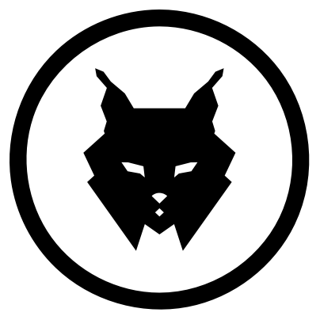

<p align="center"><a href="https://twitter.com/VOSTPTia"></a></p>

<h1><p align="center">VOSTPTia</p></h1>
<h2><p align="center">VOSTPT bot</p></h2>

<p align="center">
    <a href="https://travis-ci.com/vostpt/bot">
        
    </a>
    <a href="https://coveralls.io/github/vostpt/bot?branch=master">
        
    </a>
</p>

# Installation
Before anything else, install the dependencies:
```sh
yarn install
```

or for those who prefer `npm`:
```sh
npm install
```

# Configuration
After installing the dependencies, it's time for a quick configuration.

Create a `.env` file in the project root.

```sh
cp .env.example .env
```

Create the database directory and execute Sequelize migrations:

```bash
mkdir ./data
#ENVIRONMENT: development | test | production
npx sequelize-cli db:migrate --env ENVIRONMENT
```


Add and replace values where needed:

```
#
# Discord bot token
#
# BOT_TOKEN=
BOT_TOKEN=

#
# Cooldown interval in seconds
#
COOLDOWN=

#
# The channels to where messages should be sent
#
MAIN_CHANNEL_ID=
EARTHQUAKES_CHANNEL_ID=
FIRES_CHANNEL_ID=
WARNINGS_CHANNEL_ID=
WARNINGS_AZ_CHANNEL_ID=
WARNINGS_MD_CHANNEL_ID=
TRIGGERS_CHANNEL_ID=
MGMT_CHANNEL_ID=
VOLUNTEERS_CHANNEL_ID=
#TWFEED_CHANNEL_ID=
TWFEED_CHANNEL_ID=
FBFEED_CHANNEL_ID=
DGSCORONA_CHANNEL_ID=
CORONAFAQ_CHANNEL_ID=
JOURNAL_CHANNEL_ID=
TRAVEL_GUIDELINES=


#
# Discord commands user permission list
#

CORONAUPDATEROLES=
CORONAUPDATEUSERS=

RALLYUPDATEROLES=
RALLYUPDATEUSERS=

#
# Twitter configurations
#
# VOST PT Official
TWITTER_CONSUMER_KEY=
TWITTER_CONSUMER_SECRET=
TWITTER_ACCESS_TOKEN_KEY=
TWITTER_ACCESS_TOKEN_SECRET=

# VOST AZ Official
TWITTER_AZ_CONSUMER_KEY=
TWITTER_AZ_CONSUMER_SECRET=
TWITTER_AZ_ACCESS_TOKEN_KEY=
TWITTER_AZ_ACCESS_TOKEN_SECRET=

# VOST Europe Official
TWITTER_EU_CONSUMER_KEY=
TWITTER_EU_CONSUMER_SECRET=
TWITTER_EU_ACCESS_TOKEN_KEY=
TWITTER_EU_ACCESS_TOKEN_SECRET=

# VOSTPTia account
TWITTER_IA_CONSUMER_KEY=
TWITTER_IA_CONSUMER_SECRET=
TWITTER_IA_ACCESS_TOKEN_KEY=
TWITTER_IA_ACCESS_TOKEN_SECRET=

# Portugal DRE Official
TWITTER_DRE_CONSUMER_KEY=
TWITTER_DRE_CONSUMER_SECRET=
TWITTER_DRE_ACCESS_TOKEN_KEY=
TWITTER_DRE_ACCESS_TOKEN_SECRET=

# Rally PT Official
TWITTER_RALLY_CONSUMER_KEY=
TWITTER_RALLY_CONSUMER_SECRET=
TWITTER_RALLY_ACCESS_TOKEN_KEY=
TWITTER_RALLY_ACCESS_TOKEN_SECRET=

# VOST PT Dev
#TWITTER_CONSUMER_KEY=
#TWITTER_CONSUMER_SECRET=
#TWITTER_ACCESS_TOKEN_KEY=
#TWITTER_ACCESS_TOKEN_SECRET=

#
# Facebook configurations
# instructions to get keys: https://gist.github.com/msramalho/4fc4bbc2f7ca58e0f6dc4d6de6215dc0
#

# Main account
FACEBOOK_TOKEN_VOSTPT=
FACEBOOK_TOKEN_RALLY=


#
# FTP configuration
#

FTPSERVER=
FTPUSER=
FTPPASSWORD=

#
# DGS resume spreadsheet
#

DGSRESUMESID=
DGSRESUMESGID=
DGSRESUMESDATAGID=

#
# Firebase key
#

FBASEKEY=


# Node environment (for Sequelize)
# test/development/production

NODE_ENV=

#
# Beta mode (run only beta commands, disable all other functions)
# When disabled ('false' or empty), run all but beta commands
#
BETA_MODE=

#
# Telegram
#
TELEGRAM_API_KEY=
TELEGRAM_CHAT_ID=
TELEGRAM_RALLY_API_KEY=
TELEGRAM_RALLY_CHAT_ID=

#
# Firebase warnings key
#

WARNINGAPPKEY=

#
# Mastodon/Pleroma keys
#

VOSTPT_ACCESS_TOKEN=
PTDRE_ACCESS_TOKEN=

#
# PT Rally csv file location
#
RALLYFILEPATH=

#
# Bluesky keys
#

BSKY_HANDLE=
BSKY_PASS=
BSKY_REPOHANDLE=
```

You will also need a `data/auth/vostpt-bot.json` config (can be test version).

# Running
If you went through the previous steps successfully, you should now be able to run **VOSTPT Discord bot** with the following command:

```sh
npm start
```

Tip: use the `BETA_MODE` env variable to toggle which function in [src/jobs/index.json](src/jobs/index.js) is executed  `startProd` (`BETA_MODE=false`) for production and `startBeta`  (`BETA_MODE=true`). 


You should see an output similar to this:
```sh
READY :: Bot started @ 2019-4-14 21:27:00
```

That's it!
